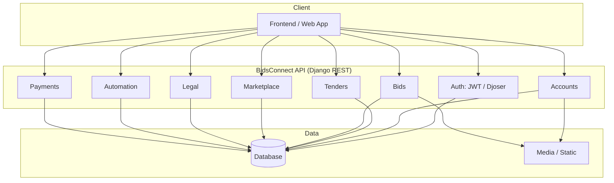
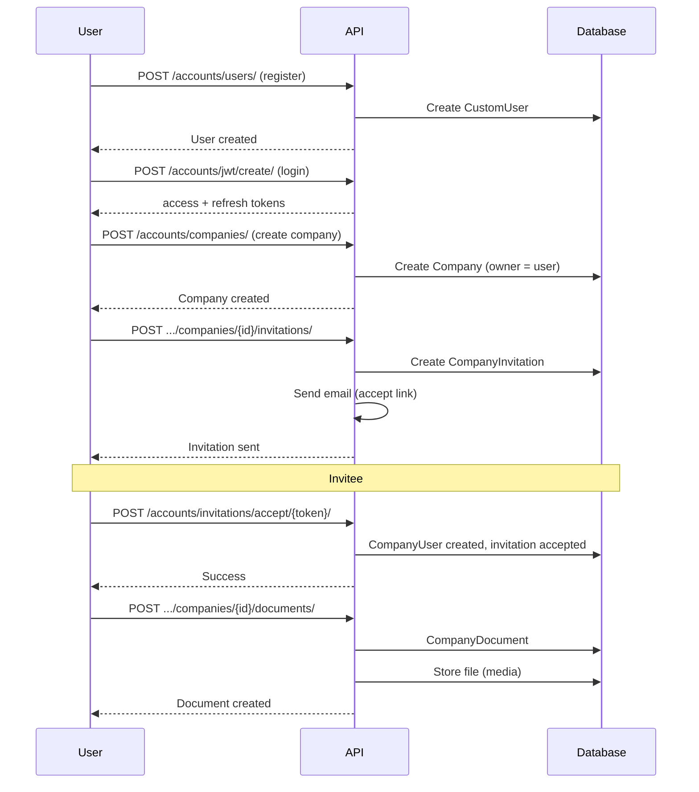
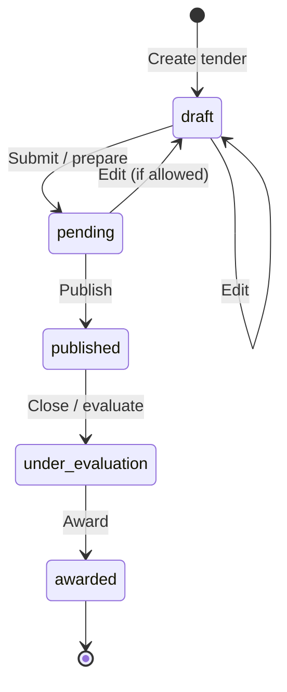
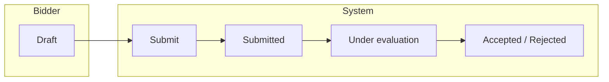
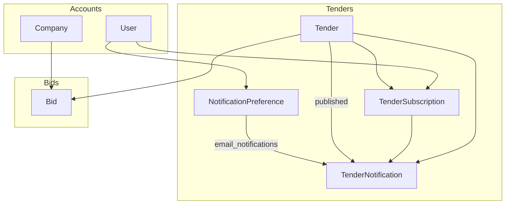
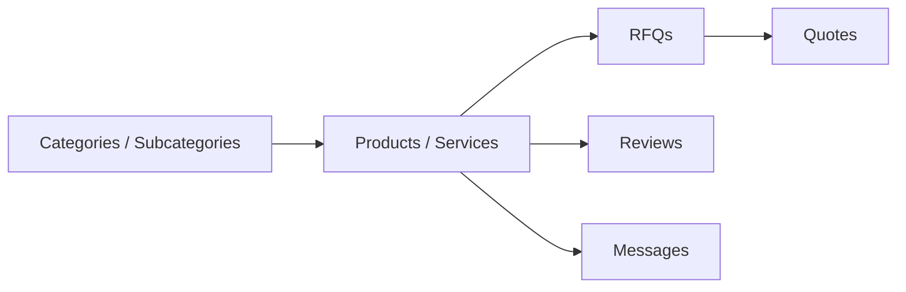
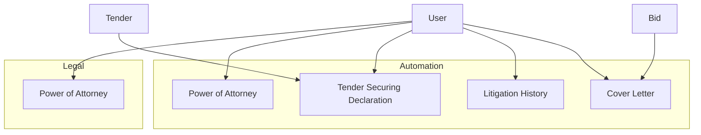
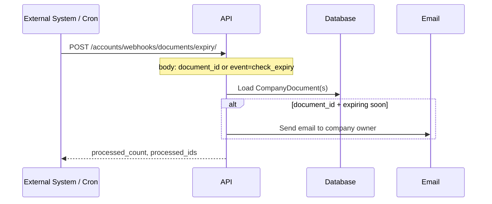

# BidsConnect System Flow

This document describes the main flows in BidsConnect: user and company setup, tender lifecycle, bid lifecycle, and how data moves between modules.

---

## 1. High-level system overview

---

## 2. User and company flow

**Summary:**

1. User registers → logs in → gets JWT.
2. User creates a company (becomes owner).
3. Owner invites users → invitee accepts → becomes company user.
4. Company users upload documents (and manage offices, certifications, personnel, etc.).

---

## 3. Tender lifecycle flow

**Actors:**

- **Publishers** (e.g. agencies / admins): create tenders, set requirements, publish, award.
- **Bidders**: discover tenders, subscribe to categories, receive notifications.

**Flow:**

1. Create tender (draft) → add required documents, financial/experience/personnel requirements, schedule, technical specs.
2. Publish → status becomes published; subscribers (by category/subcategory/procurement process) get notified (email if enabled).
3. After deadline → status can move to under_evaluation.
4. Award → winner recorded; status awarded.

**Reference data:** Categories, subcategories, procurement processes, agencies are managed (often admin) and used when creating/subscribing to tenders.

---

## 4. Bid lifecycle flow

**Flow:**

1. **Create bid** (draft) — linked to tender and company.
2. **Add responses** — documents, financial, turnover, experience, personnel, office, source, litigation, schedule, technical.
3. **Submit** — `POST /bids/{id}/submit/` → status moves to submitted (validations: deadline, required data).
4. **Evaluation** — evaluators use bid evaluations and audit logs; status can move to under_evaluation, then accepted/rejected.

Bid is always tied to one **tender** and one **company** (and user).

---

## 5. Data flow: Tender → Notification → Bid

- **TenderSubscription**: user subscribes to categories/subcategories/procurement process; when a tender in that set is published, they can get a **TenderNotification**.
- **NotificationPreference**: per-user (e.g. email on/off, frequency for digest).
- **Bid**: references Tender and Company; created by users belonging to that company.

---

## 6. Marketplace flow (simplified)

- Sellers list **products/services** under **categories/subcategories**, with **price lists** and **product images**.
- Buyers create **RFQs** with **RFQ items**; sellers respond with **quotes** and **quote items**.
- **Reviews** and **messages** are tied to marketplace interactions.

---

## 7. Legal and automation flow

- **Legal** app: power-of-attorney and related legal documents (CRUD via API).
- **Automation** app: generated documents (power of attorney, tender securing declaration, litigation history, cover letter) — create/retrieve/update via API; typically used when preparing bids or complying with tender requirements.

---

## 8. Payments

- **Payment** is a generic model (content type + object id) so it can be linked to any entity (e.g. subscription, bid fee, marketplace order).
- **Flow**: client creates payment via `POST /api/v1/payments/` (user is set from JWT); list/retrieve are scoped to the current user.

---

## 9. Document expiry and webhook

- **Company documents** have `expiry_date`; “expiring soon” is defined in the accounts app (e.g. within N days).
- **Webhook** can process a single document (and optionally send email) or list expiring documents (`event: "check_expiry"`).

---

## 10. Summary

| Flow | Entry | Main APIs | Outcome |
|------|--------|-----------|---------|
| User & company | Register, login | Accounts (users, companies, invitations, documents, …) | Company and team ready to tender/bid |
| Tender | Create draft | Tenders (categories, tenders, requirements, publish) | Published tender |
| Notifications | Subscribe + preferences | Tenders (subscriptions, notification-preferences) | Notifications when tenders published |
| Bid | Create draft | Bids (bids, documents, *-responses, submit) | Submitted bid |
| Evaluation | Evaluator | Bids (evaluations, audit-logs) | Accepted/rejected bid |
| Marketplace | List / browse | Marketplaces (categories, products, RFQs, quotes) | RFQs and quotes |
| Legal / automation | User action | Legal, Automation | Documents for compliance / bidding |
| Payments | User action | Payments | Payment record linked to user (and optional object) |
| Document expiry | Webhook / cron | Accounts webhook | Emails / list of expiring documents |

For detailed endpoint lists and request/response conventions, see [API.md](API.md).
