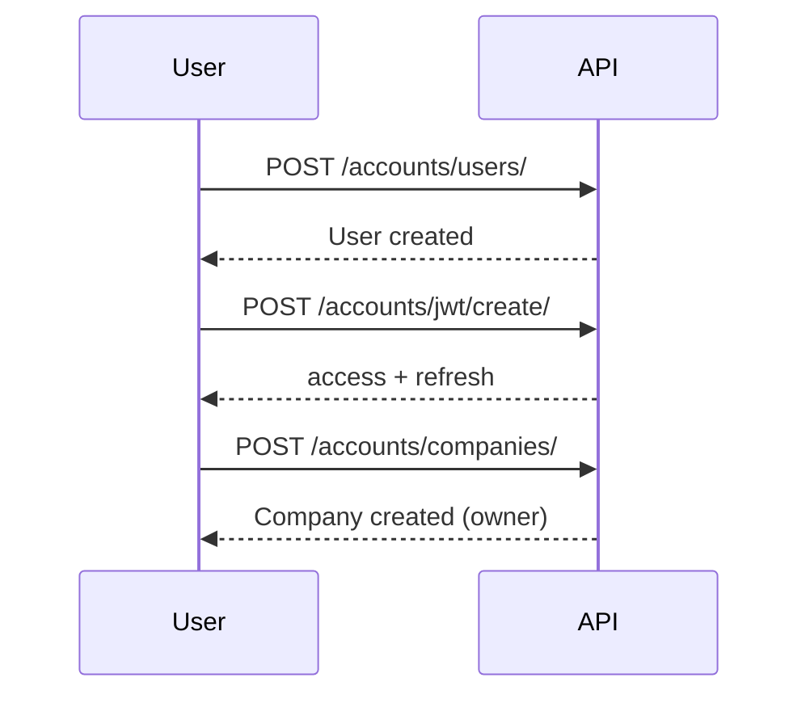
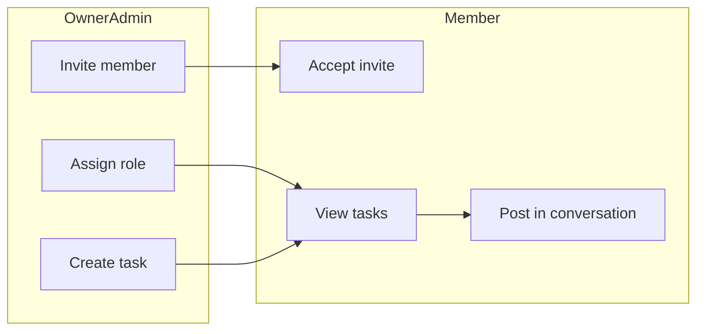
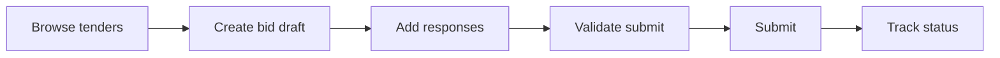
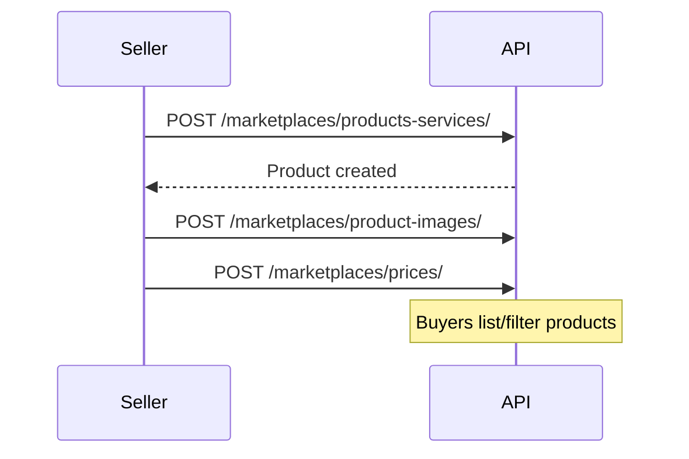
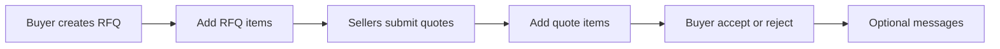

# BidsConnect User Journeys

This document walks through five main user flows: onboarding, team, applying for a tender, advertising on the marketplace, and request for quotes. Each section lists steps with API hints and an optional diagram.

---

## 1. User onboarding

**Goal:** New user registers, logs in, and either creates a company or joins one via invitation.

### Steps

1. **Register** — `POST /api/v1/accounts/users/` (no auth). Body: `email`, `password`, `phone_number`, `first_name`, `last_name`. Optional: `invitation_token` if joining from an invite link.
2. **Login** — `POST /api/v1/accounts/jwt/create/` with `email` and `password`. Response includes `access` and `refresh` tokens.
3. **Use token** — Send `Authorization: Bearer <access>` on all subsequent requests.
4. **Create company (or join)** — If creating: `POST /api/v1/accounts/companies/` with company details; user becomes owner. If invited: after registering with `invitation_token`, accept via `POST /api/v1/accounts/invitations/accept/{token}/` (authenticated).
5. **Optional: get profile** — `GET /api/v1/accounts/users/me/` to confirm user and company membership.

### Flow

See also: [USER_ONBOARDING_AND_TEAMS.md](USER_ONBOARDING_AND_TEAMS.md) Section 1.

---

## 2. Team (members, roles, tasks, conversation)

**Goal:** Owner or admin invites members, assigns roles, creates tasks for the team, and uses tender conversations for collaboration.

### Steps

1. **Invite by email** — `POST /api/v1/accounts/companies/{company_pk}/invitations/` with `invited_email` and `role` (owner | admin | manager | user). Auth: company owner or admin.
2. **Invitee accepts** — Invitee logs in and calls `POST /api/v1/accounts/invitations/accept/{token}/` (token from email link).
3. **List or update members** — `GET /api/v1/accounts/companies/{company_pk}/users/`, `PATCH .../users/{id}/` to change role.
4. **Create company tasks** — `POST /api/v1/accounts/companies/{company_pk}/tasks/` with `title`, optional `description`, `assignee`, `tender`, `bid`, `due_date`, `status`. Only owner/admin can create; assignee can update own task status.
5. **List tasks** — `GET /api/v1/accounts/companies/{company_pk}/tasks/` (filter: `?status=`, `?assignee=`, `?tender=`, `?bid=`).
6. **Tender conversation** — Get or create: `POST /api/v1/tenders/conversations/` with `{"tender_slug": "<slug>"}`. List messages: `GET /api/v1/tenders/conversations/{id}/messages/`. Post: `POST .../messages/` with `{"content": "..."}`.

### Flow

See also: [USER_ONBOARDING_AND_TEAMS.md](USER_ONBOARDING_AND_TEAMS.md) Sections 2–5.

---

## 3. Applying for a tender

**Goal:** User (as part of a company) finds a tender, creates a bid, fills responses, validates, submits, and tracks status.

### Steps

1. **Login** — Ensure JWT is set (see onboarding).
2. **Browse tenders** — `GET /api/v1/tenders/tenders/` (filter: `?status=published`, `?category=`, `?subcategory=`). Optional: `GET /api/v1/tenders/categories-with-subcategories/` for filters.
3. **Optional: subscribe** — `POST /api/v1/tenders/subscriptions/` with category/subcategory/procurement; set `GET/PATCH /api/v1/tenders/notification-preferences/` for email frequency (immediate/daily/weekly).
4. **Create bid (draft)** — `POST /api/v1/bids/` with `tender` (id), `company` (uuid), `total_price`, `currency`, etc. User must belong to the company.
5. **Add responses** — Use nested endpoints under `POST /api/v1/bids/{bid_pk}/...`: documents, financial-responses, turnover-responses, experience-responses, personnel-responses, office-responses, source-responses, litigation-responses, schedule-responses, technical-responses.
6. **Validate before submit** — `GET /api/v1/bids/{id}/validate-submit/` to check readiness (deadline, required docs, etc.).
7. **Submit** — `POST /api/v1/bids/{id}/submit/`. Status becomes `submitted`.
8. **Track status** — `GET /api/v1/bids/{id}/` or list with `?status=`. Status flow: draft → submitted → under_evaluation → accepted or rejected. Use `GET .../audit-logs/` for history.

### Flow

See also: [SYSTEM_FLOW.md](SYSTEM_FLOW.md) Section 4, [API.md](API.md) Bids.

---

## 4. Advertising on the marketplace

**Goal:** Seller (company owner or admin) lists products or services so buyers can discover and request quotes.

### Steps

1. **Ensure company** — User must own or be admin of a company (`get_primary_company()`). Create company via onboarding if needed.
2. **Create product or service** — `POST /api/v1/marketplaces/products-services/` with `name`, `description`, `category_id`, `subcategory_id`, `type` (Product | Service). Company is set from current user’s primary company.
3. **Add images** — `POST /api/v1/marketplaces/product-images/` with `product_service`, `image`, optional `caption`, `is_primary`.
4. **Add price list** — `POST /api/v1/marketplaces/prices/` with `product_service`, `unit_price`, `unit`, `minimum_quantity`, optional `description`, `is_active`.
5. **Buyers discover** — Buyers use `GET /api/v1/marketplaces/products-services/` (filter: `?category=`, `?subcategory=`, `?min_price=`, `?max_price=`, search).

### Flow

See also: [SYSTEM_FLOW.md](SYSTEM_FLOW.md) Section 6, [API.md](API.md) Marketplace.

---

## 5. Request for quotes (RFQ)

**Goal:** Buyer creates an RFQ; sellers submit quotes; buyer accepts or rejects; optional messaging.

### Steps

1. **Buyer creates RFQ** — `POST /api/v1/marketplaces/rfqs/` (buyer = current user). Then add items: `POST /api/v1/marketplaces/rfq-items/` with `rfq`, `name`, `description`, `quantity`, `unit`, `type`, optional `category`, `subcategory`, `image`.
2. **Sellers see RFQs** — Sellers browse `GET /api/v1/marketplaces/rfqs/` (filter `?status=OPEN`) and view items.
3. **Seller submits quote** — `POST /api/v1/marketplaces/quotes/` with `rfq`, `details`, `seller` = current user’s primary company. Then add quote items: `POST /api/v1/marketplaces/quote-items/` with `quote`, `rfq_item`, `proposed_price`, `details`.
4. **Buyer lists quotes** — `GET /api/v1/marketplaces/quotes/` (filter by rfq or status). Update quote: `PATCH .../quotes/{id}/` with `status`: ACCEPTED or REJECTED.
5. **Optional: messages** — `GET/POST /api/v1/marketplaces/messages/` for conversation between buyer and seller (sender, receiver, content; filter by user).

### Flow

See also: [SYSTEM_FLOW.md](SYSTEM_FLOW.md) Section 6, [API.md](API.md) Marketplace (RFQs, quotes, messages).

---

## See also

- [API.md](API.md) — Full endpoint reference
- [USER_ONBOARDING_AND_TEAMS.md](USER_ONBOARDING_AND_TEAMS.md) — Onboarding, members, roles, tasks, tender conversations
- [SYSTEM_FLOW.md](SYSTEM_FLOW.md) — System flows and data diagrams
- [BIDS_CONNECT_SPEC.md](BIDS_CONNECT_SPEC.md) — Product rules and backlog
